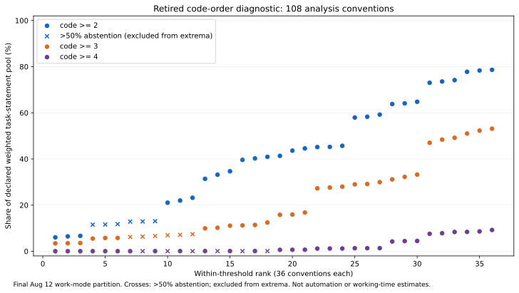
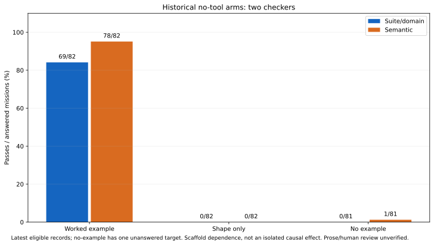
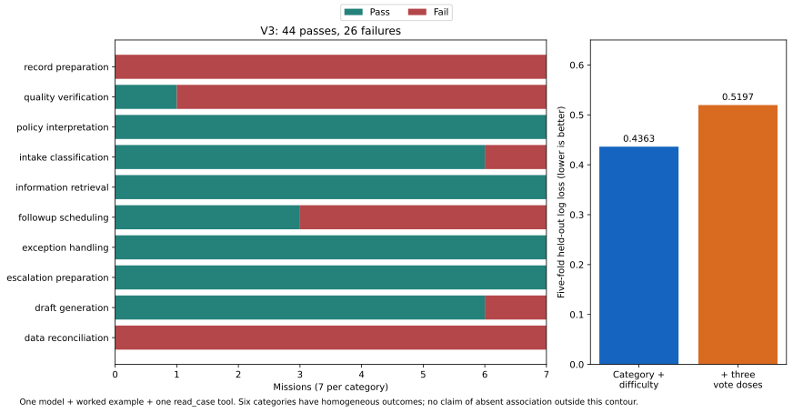

# От оценки задачи к проверке результата: три ограничения измерения способностей агента

**Результат.** В AllJobs числовая оценка зависит от того, какой вопрос задан, какая помощь
предоставлена агенту и что именно проверяет оценщик. Открытый replay показывает это на трёх
разных анализах: диагностике отменённой шкалы, историческом сравнении вариантов подсказки и
проверке предсказательной полезности голосов моделей. Анализы не измеряют долю заменяемых
рабочих мест, рабочего времени или корпоративный ROI.

Это дополнительная аналитическая публикация на существующих данных. Новые запросы к моделям
не выполнялись; исходные августовские результаты и их ограничения сохранены.

## 1. Число меняется вместе с правилом его получения

Историческая шкала L0–L4 смешивала место выполнения работы, необходимость проверки,
ограниченность процесса и обработку исключений. Её порядок нельзя считать измеренной
количественной шкалой. Мы используем его только для диагностики отменённого вычислительного
правила: четыре способа объединить коды × три порога × три веса × три знаменателя = **108
вариантов**. Это не 108 допустимых содержательных оценок автоматизации.

Для дополнительного replay подготовлены **342 агрегированные ячейки** по набору кодов трёх
маршрутов и метке screen/mixed/physical/unsettled; **unsettled в JSON записан как `null`**.
Они содержат число задач и суммы весов, но
не тексты задач и не ответы моделей. Ячейки получены из последних записей по каждой паре
«activity ID, маршрут»: всего **18 796 задач**, из них **18 539** имеют три записи. Отсутствующие
ответы не превращаются в отрицательные голоса. Для воспроизведения старой вычислительной
конвенции используются имеющиеся коды; совпадение одного оставшегося кода поэтому не означает
согласие трёх моделей. Идентичность обслуживавших исторические запросы backend не доказана.

Новый расчёт использует **финальное замороженное разделение work mode от 12 августа**. Среди
**90** вариантов, оставляющих не менее половины массы знаменателя разрешённой, крайние доли
составляют **0,025406% и 78,631813%**, отношение около **3 095**. Остальные 18 вариантов
показаны, но исключены из крайних значений из-за более чем 50% воздержания. Доля всегда
рассчитывается от объявленного пула, включая массу, по которой правило воздержалось; отдельная
колонка показывает долю только от разрешённой массы. Whole-corpus включает **950 задач с
неразрешённым work mode**, а оба screen-пула их исключают: screen-only содержит 8 990 задач,
screen-and-mixed — 10 331. Минимум относится к whole-corpus пулу с российскими весами,
порогом 4 и минимумом кодов **или exact-code unanimity**; максимум — к 8 990 screen-only задачам
с равными весами, максимумом кодов и порогом 2 (7 069/8 990).

В прежнем незамороженном work-mode checkpoint опубликованы 0,025406–78,331215% и отношение
около 3 083. Он остаётся историческим результатом; эта заметка не выдаёт расчёт по финальному
разделению за его побайтовое воспроизведение. Веса O*NET importance и российской занятости
задают разные индексы. Ни один не задаёт распределения рабочего времени между задачами.



[Все числители, знаменатели и варианты](../../workforce-graph/data/publication_2026_09_06/reproduced/definition_sensitivity.csv).
График характеризует чувствительность вычислительной конвенции. Он не сравнивает причинное
влияние методики и выбора модели.

## 2. Пример ответа и оценщик меняют наблюдаемый результат

В исторической серии использовался маршрут `deepseek-v4-pro`, один ход без инструментов и
синтетические support/back-office missions. Из 120 миссий 30 находятся в development split;
часть миссий не имеет доступного предметного оператора. В измеренную группу вошли **82**
миссии. Для каждой сохраняется последняя подходящая запись в объявленном arm/run_spec;
десять повторных записей worked-example arm не считаются дополнительными наблюдениями.

| Подсказка | Suite/domain passes / ответы | Semantic passes / ответы | Выбрано / без ответа |
|---|---:|---:|---:|
| Пример другой development-миссии той же категории | 69/82 | 78/82 | 82/0 |
| Только структура ответа | 0/82 | 0/82 | 82/0 |
| Без примера | 0/81 | 1/81 | 82/1 |

На отдельной подгруппе **78 миссий с полным набором голосов** worked-example результаты —
**67/78** и **75/78**. Эти знаменатели нельзя смешивать с 82 ответами. Неответ в arm без
примера исключён из доли по ответам и явно посчитан; он не записан как неправильный ответ.

Suite/domain применяет предметные инварианты, в том числе строгие требования к представлению
ответа. Hardened semantic comparator сравнивает объявленные решения и состав элементов, но
не подтверждает семь свободных текстовых полей и необходимую человеческую holistic review.
Результат зависит от определения успеха; ни один из двух оценщиков не выбран здесь единственным
основным исходом.



Это наблюдаемая зависимость от scaffold, **не изолированный причинный эффект формата**.
Пример разделял хотя бы один точный non-ID output literal с 67 из 82 целевых миссий. Вместе
с представлением ответа передавалось переиспользуемое содержимое. Предложенный redacted arm
не был запущен: преобразованные примеры не прошли предметную проверку 82/82. Исполнение
некомпетентного примера не устранило бы смешение причин.

[Таблица с обеими группами и знаменателями](../../workforce-graph/data/publication_2026_09_06/reproduced/scaffold_checkers.csv).

## 3. Голоса не улучшили прогноз в одном узком дополнительном эксперименте

V3 использует **70 различных миссий**, по семь в десяти категориях, одну конфигурацию
`google/gemini-3.5-flash-lite`, отдельный категорийный пример и ровно один read-only вызов
`read_case` перед ответом. Это проверка детерминированного соответствия synthetic
agent-plus-scaffold, а не GUI, полноценного workflow или способности модели вне этого контура.

Переисполнение grader по опубликованным deliverables воспроизводит **44 passes и 26 failures**.
Пятикратная перекрёстная проверка по удержанным миссиям сравнивает ridge logistic regression по категории и
заранее заданной структурной сложности с добавлением трёх доз голосов. Средняя log loss
меняется с **0,4362573843** до **0,5197189981**; улучшение равно **−0,0834616138**. Replay заново
выполняет **1 999 перестановок в пределах категории**, одностороннее **p = 0,9765**.



Вывод остаётся `NO_DETECTED_INCREMENTAL_ASSOCIATION`. Он не устанавливает отсутствие связи
вообще. **Шесть категорий имеют однородные исходы** — четыре только успешные и две только
неуспешные; различение внутри категории опирается на четыре оставшиеся категории. Реальная
мощность для правдоподобных небольших эффектов не установлена. Сложность описана размером и
структурой входа/эталонного выхода, а не полной когнитивной или организационной сложностью.

Добавление признаков не обязано математически ухудшать этот алгоритм. Наблюдаемое ухудшение
не объясняет свой собственный механизм и не доказывает бесполезность оценок LLM в других задачах.

[Миссии, признаки и удержанные прогнозы](../../workforce-graph/data/publication_2026_09_06/reproduced/v3_missions.csv),
[распределение исходов по категориям](../../workforce-graph/data/publication_2026_09_06/reproduced/v3_categories.csv).

## Воспроизведение и границы открытых данных

В корне чистого публичного репозитория:

```bash
cd workforce-graph
uv sync --locked --python 3.14.7 --extra dev
uv run --locked --python 3.14.7 --with matplotlib==3.10.8 \
  python scripts/reproduce_research_note.py --output /tmp/alljobs-research-note
```

Для вычислений без рисунков достаточно `uv run python scripts/reproduce_research_note.py
--no-figures --output /tmp/alljobs-research-note`. Быстрый вариант `--skip-permutations`
пересчитывает grades/log loss, но маркирует p как **историческую справку, не новый пересчёт**.
Полный вариант печатает прогресс перестановок. API-ключи и модельные запросы не нужны.
Выходной каталог должен быть новым: существующие результаты, включая поставленные рисунки,
не перезаписываются. Для повторного запуска выберите другой `--output`.

Публичный вход [replay_inputs.json](../../workforce-graph/data/publication_2026_09_06/replay_inputs.json)
содержит достаточные статистики, производные per-mission outcomes и SHA-256 исходных
файлов. Для чувствительности публично воспроизводятся **ячейки → формулы → таблица/рисунок**;
для arms — **производные outcomes → частоты с явными знаменателями**; для V3 — опубликованные
**входы/ответы → grader → cross-validation → перестановки**. Это разные уровни репликации.
Хэши закрытых файлов связывают происхождение, но не позволяют внешнему читателю проверить
неопубликованные строки или историческую идентичность backend.

Отдельная команда `prepare-inputs` предназначена для владельца частных источников. Она не
нужна внешнему читателю и откажет при отсутствии исходников. Подготовка не включает тексты
O*NET, raw model generations, WEF/WORKBank extracts, microdata, PDF или секреты в новый
публичный supplement. Оригинальные рисунки и аналитический код распространяются под
Apache-2.0; права сторонних источников сохраняются. Замороженные августовские файлы не изменены.

## Что проверять дальше

Ближайший новый эксперимент должен отделить доступность подходящего инструмента, его
корректный вызов, правильность результата и обнаружение дефекта во входе. Старые результаты
пригодны для разработки, но новая подтверждающая часть требует заранее закрытых случаев.
Эта заметка не утверждает, что такой эксперимент уже выполнен.

Внешние работы задают контекст, но не валидируют наши частоты: [Thomson Reuters Future of
Professionals 2026](https://www.thomsonreuters.com/en/institute/future-of-professionals-2026/report)
обсуждает качество и использование AI на основе опроса; [Wiles et al.](https://www.emmawiles.com/storage/ai_employee.pdf)
исследуют человеческую проверку и организационное представление AI; [Csaszar, Ketkar, Kim](https://csaszar.info/research/2024-stratsci-ai-sdm)
рассматривают AI-оценки в другой предметной области. Человеческое доверие, экспертиза и
корпоративный эффект не выводятся из наших агентных синтетических испытаний.

Исходные результаты и подробные ограничения: [основной отчёт](2026-08-12-research-completion.md),
[predictive-validity successor](2026-08-12-predictive-validity-successor.md),
[публичный пакет](https://github.com/dilp79/alljobs-agent-work-research).
