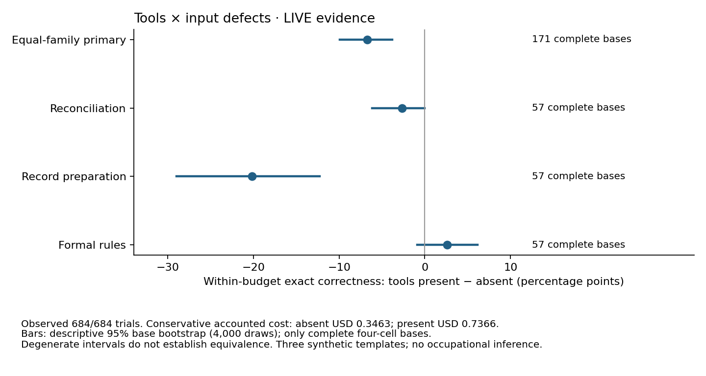

# Доступ к инструментам и правильное завершение в пределах бюджета: 684 испытания

В трёх синтетических шаблонах доступ к локальным инструментам снизил долю полностью
правильных завершений в заданных лимитах с **337/342 (98,54%) до 314/342 (91,81%)**.
Заранее выбранная парная оценка — **−6,73 процентного пункта**, стратифицированный
bootstrap-интервал 95% **[−9,94; −3,80] п.п.** Все 28 неудач с инструментами вызваны
исчерпанием разрешённых шагов или вызовов; численные лимиты не сообщались модели.
Это результат для конкретной политики
исполнения и ограничений; он не устанавливает, что инструменты ухудшают качество
поданных конечных ответов. Основная серия завершена полностью, без технических пропусков.

Проверяем, как доступ к локальным инструментам и обнаружимые дефекты исходных записей
влияют на полностью правильное решение при одинаковых ограничениях ресурсов.
Описательная оценка подходящего инструмента сама по себе не отвечает на этот вопрос:
в [ATE-приложении](ate-appendix_06--092026_19-32.md) отдельно пересчитаны соответствия
описаний, тогда как здесь агент действительно выполняет новые задания.

## Что именно проверяется

Основная серия содержит **171 новый базовый случай**, по 57 в каждой из трёх семей.
Каждый случай имеет четыре условия: инструментов нет/есть × исходные данные чистые/с
заложенным обнаружимым дефектом. Запланированы и выполнены **684 испытания**. Все варианты
одного случая остаются вместе при анализе. Это случайно сгенерированные экземпляры
трёх заранее заданных шаблонов; они не представляют 171 вид профессиональной деятельности.

| Семья | Требуемый результат | Пример класса дефекта |
|---|---|---|
| Сверка записей | Полное правильное решение и соответствующее состояние записей | Противоречащие друг другу записи платежа |
| Подготовка записей | Нормализованные записи из видимого актуального источника | Устаревшая версия записи |
| Применение формальных правил | Решение и записи, соответствующие всем явно заданным правилам | Несогласованные исходные арифметические значения |

Нужная по условию эскалация или отказ считаются **правильным решением**. Это отдельно
отмечается в результатах и не называется завершённой бизнес-операцией. Изменения
проверяются в предложенном локальном состоянии; реальная внешняя система не изменяется.

Модель: `google/gemini-3.8-flash`, прямой OpenRouter с единственным разрешённым
провайдером `google-ai-studio`, настроенным стандартным обслуживанием, LOW reasoning и без fallback.
Ответы проверяются по полям тела ответа OpenRouter: модель, провайдер, использование
токенов и `is_byok=false`. Generation-endpoint в основной серии не запрашивался;
наблюдаемый `service_tier` равен null, поэтому фактический tier независимо не подтверждён.
Это подтверждение остальных перечисленных полей со стороны брокера, а не независимо
наблюдаемый native Google `modelVersion`. Закреплённый canonical slug каталога —
`google/gemini-3.8-flash-20260902`.

При фиксированном состоянии входа условия с инструментами и без них получают одинаковые
видимые факты и правила. Дефектный вариант отличается заранее заданным изменением данных.
Выбранная модель и настроенные ограничения одинаковы во всех четырёх условиях.
Инструменты — оригинальные локальные операции выбора строк таблицы, целочисленной
арифметики и нормализации текста. Они работают только с переданными видимыми данными
и не обращаются к эталону или grader. Их описания, дополнительные сообщения и вызовы
входят в назначенное условие и его расход. Внешние серверы ATE не устанавливались и
не тестировались; их доступность или качество по этому эксперименту не оцениваются.

На одно испытание отведены до трёх агентных completion-шагов, 2 400 выходных токенов
суммарно с reasoning, 32 000 входных токенов суммарно, восемь локальных вызовов инструментов
и 120 секунд. Численные лимиты и предупреждение о последнем шаге модели не передаются:
системный промпт говорит только «Finish within the fixed budget». В ветви без инструментов
runner заканчивает испытание после первого ответа; остановка по числу агентных шагов
или вызовов инструментов структурно возможна только в ветви с инструментами.
Это ограничивает интерпретацию как сравнение именно этих двух политик исполнения.
На каждом шаге для HTTP 502/503/504 разрешены не более двух дополнительных
HTTP-попыток: максимум девять HTTP-попыток в пределах тех же 120 секунд.
Токенные суммы проверяются по полученным квитанциям успешных ответов. Ошибка без usage
оставляет неизвестное использование и полный денежный резерв; нулевой скрытый расход
или соблюдение суммарного лимита всех скрытых токенов в таком случае не утверждаются.
Ответы агента не исправляются и не повторяются по
результату grader. Основные запросы выполняются последовательно с минимальным
интервалом старта одна секунда. Превышение агентом лимита испытания считается
неправильным результатом в метрике «решить в пределах бюджета». Отказ провайдера или
общего бюджетного ограничителя остаётся неполным наблюдением, а не ошибкой модели.

Для каждого варианта начинается новый разговор. Порядок испытаний заранее перемешан
по фиксированному seed; это не утверждение о полном counterbalancing всех позиций.
Эталон, признак дефекта, partition и результаты grader в запрос модели не попадают.
Проверяется весь конечный JSON: значения, типы и состав полей. Повторяющиеся ключи
JSON недопустимы, включая вложенные объекты.

Точный системный промпт (оригинальный текст проекта):

```text
Perform only the bounded local task from the supplied facts and rules. All facts are already visible. Available tools only help compute or inspect them. Return exactly one JSON object with decision, issues and records, following the output contract. No Markdown or extra fields. Sort records by id and issues lexically. Never claim an external write. No grader or correctness feedback is available. Finish within the fixed budget.
```

Пользовательское сообщение — канонический JSON объекта `case["public"]` из опубликованного
набора: `json.dumps(public, sort_keys=True, ensure_ascii=False, separators=(",", ":"), allow_nan=False)`.
Полный внутренний протокол и транспортный runner не входят в публичный релиз;
их хеши опубликованы в `source_receipts.json`. SHA-256 текста протокола:
`65fc0217a6e2ee083bada4a083130aa2a62505d80f0ef0b472d5b17a858b65ec`.
Описание метода и точный промпт доступны здесь; по одному хешу читатель не может
восстановить приватный протокол или независимо подтвердить время его фиксации.

## Фиксация и пилот

Исходники, протокол, план и все основные случаи зафиксированы и отправлены в Git
до первого основного запроса: `aeab7d88e9606b91721214bcac6efe258ed9f592`.
Semantic SHA-256 плана:
`770944e6f811066058e1c2a26deeac2ec09c8c4847c542d1034fb4bf551f16b3`;
набора основных случаев:
`ae137fdfaa7758e7a45e4d921298736e54a3e10dce1e8afbdbb3475679e7f696`.
Runtime проверяет эти связи и точные исходники до загрузки credentials и отправки запроса.
Во время основной серии гипотезы, случаи, критерии и правила остановки не менялись.

Завершённый developmental-пилот включал шесть других базовых случаев, по два на семью,
и дал **24/24 правильных результата**, без технических ошибок. Он потребовал 31 запрос,
23 216 входных и 4 488 выходных токенов, включая thinking; оценка по полным тарифам и
сообщённое OpenRouter списание составили по **$0,034242**. Это свидетельство
работоспособности и потолка малой выборки. Оно не доказывает эквивалентность условий
и не даёт надёжной оценки мощности.

Более ранние незавершённые попытки сохраняются отдельно: native Google останавливался
на транспортных ошибках и квоте бесплатного обслуживания; при квалификации брокера
исправлены ошибки обработки его квитанций. Повторные префиксы не увеличивают число
независимых случаев. До основной серии учтено **$0,10351350**, включая резерв
**$0,04996650** для запросов с неизвестным использованием. Эти расходы не скрываются
за стоимостью одного удачного пилота.

В основном генераторе заранее заданы четыре–восемь строк, разные позиции дефектов,
остатки, глубина истории и граничные ветви формальных правил. Эта вариативность не
подбиралась по ошибкам модели в основной серии. Исторические 70 миссий V3 в неё не входят.

## План анализа

Первичная величина — разность вероятностей полностью правильного решения между
условиями с инструментами и без них, усреднённая внутри базового случая по чистому
и дефектному входу, затем с равными весами трёх семей. Единица повторной выборки для
интервалов — базовый случай внутри семьи, а не отдельный запрос или одна из четырёх ячеек.

Применяется перцентильный bootstrap: 4 000 выборок, seed 20260906, порядок баз из
замороженного suite. Такой же порядок использует исходная основная сводка и публичный
replay. Конечный Monte-Carlo расчёт зависит от порядка списка: служебный аудит,
читающий те же результаты по алфавиту файлов, дал первичный интервал [−9,94; −3,51]
п.п. вместо [−9,94; −3,80], для чистого входа [−13,45; −5,26] вместо [−13,45; −5,85]
и для взаимодействия [0,00; +11,11] вместо [−0,58; +10,53]. Точечные оценки совпадают.
Обе версии сохранены; основная статья следует исходному порядку suite, не выбирает
интервал по желаемому выводу. Шаг значений составляет примерно 0,29 п.п. для первичной
и 0,58 п.п. для вторичных оценок; дополнительные десятичные знаки не означают большую
статистическую точность. Инвариантность к порядку — исправление будущей версии анализа,
а не изменение замороженного кода этой серии.

Практический ориентир **+15 процентных пунктов** выбран как проектное суждение для
этого ограниченного набора, а не как установленный экономический порог. При 171 случае
консервативная нормальная оценка полуширины интервала составляет около 0,1499;
распределительно свободная оценка для ограниченных разностей — около 0,2077.
Это план точности, не утверждение о подтверждённой статистической мощности.

Вторично сообщаются раздельные эффекты для чистых и дефектных входов, их взаимодействие,
тип правильного решения, исправление, завершение операции, пропущенные дефекты,
небезопасное ложное завершение, лишняя эскалация, некорректные ответы, вызовы инструментов,
токены, запросы, время и стоимость. Технически пропущенные ячейки и даже не начатые случаи
сохраняются в знаменателях. При неполноте основная величина для всего запланированного
набора отделяется от оценки по полностью наблюдаемым случаям и границ для пропусков.

Нулевая дисперсия малой или однородной выборки может дать вырожденный bootstrap-интервал.
Такой интервал не доказывает отсутствие эффекта в профессиях, других моделях или более
сложных задачах. Реальные списания, оценка по тарифам и неизвестный резерв учитываются
отдельно; провайдерский счёт не выдаётся за независимо проверенный invoice.

## Результаты основной серии и воспроизведение

Проверены 684 результата и 1 021 пара журналов отправки/получения ответа; все 171
базовый случай полны. Повторная оценка совпала с сохранённой сводкой по каждому полю.
Нет технических ошибок, неизвестного расхода, повторных HTTP-попыток, некорректного
JSON или ошибок локальных инструментов в основной серии. Восемь закреплённых исходных
файлов и протокол сохранили исходные хеши.

| Семья | Чистый вход, без инструментов | Чистый вход, с инструментами | Дефектный вход, без инструментов | Дефектный вход, с инструментами |
|---|---:|---:|---:|---:|
| Сверка записей | 57/57 | 54/57 | 57/57 | 57/57 |
| Подготовка записей | 57/57 | 44/57 | 57/57 | 47/57 |
| Формальные правила | 57/57 | 57/57 | 52/57 | 55/57 |
| Всего | 171/171 | 155/171 | 166/171 | 159/171 |

**Структура 33 неудач:** без инструментов — пять несовпадений полного решения и
состояния; с инструментами — 26 исчерпаний трёх completion-шагов и два исчерпания
восьми вызовов инструментов. Последние 28 испытаний не дали конечного решения;
они сохранены как неуспех в пределах бюджета, а не удалены из знаменателя.
Все 314 поданных конечных ответов с инструментами прошли проверку. Сравнение только
поданных ответов отбирает разные подмножества случаев и не заменяет первичную оценку.
23 из 28 таких остановок относятся к подготовке записей. Все пять несовпадений без
инструментов приходятся на дефектные формальные правила: ответ `complete` при исходном
арифметическом расхождении на +1. В этой ячейке инструменты дали 55/57 правильных
завершений против 52/57 без них; это локальный описательный результат, а не общий
положительный эффект.

Вторичные оценки эффекта доступа к инструментам: чистый вход **−9,36 п.п.**
(95% интервал [−13,45; −5,85]), дефектный **−4,09 п.п.** ([−8,19; 0,00]).
Взаимодействие составляет **+5,26 п.п.**, но интервал **[−0,58; +10,53]** включает
ноль. Утверждение, что дефекты меняют эффект инструментов, этой серией не установлено.
Вторичные интервалы описательные, без поправки на множественные сравнения.

Из 651 правильного решения 430 завершают операцию, 114 правильно эскалируют вопрос
и 107 правильно отклоняют операцию. Включённые в них 104 правильных исправления —
дополнительная характеристика, не отдельное слагаемое. Grader также отмечает 325
обнаруженных дефектов и 17 случаев `missed_defect`: пять пропусков в поданном ответе
и 12 остановок без ответа. Поэтому 17 нельзя интерпретировать как 17 ошибочных
поданных решений. Небезопасных ложных завершений — пять, лишних эскалаций — ноль. Эти поля не являются оценкой человеческого доверия или качества
работы в организации.

| Ресурс основной серии | Без инструментов | С инструментами |
|---|---:|---:|
| Испытания | 342 | 342 |
| Completion-запросы | 342 | 679 |
| Локальные вызовы инструментов | 0 | 1 060 |
| Входные токены | 198 377 | 661 392 |
| Выходные токены, включая thinking | 52 662 | 64 161 |
| Оценка по полным тарифам, USD | 0,34626525 | 0,73664775 |

Таблица ресурсов первоначально получена из приватной диагностики; все её суммы также
восстанавливаются из числовых квитанций `attempts` публичного `replay_inputs.json`.
В [README публичного релиза](../../README.md) дан исполняемый пример группировки по
наличию инструментов. Суммы по условиям описывают наблюдённый расход, не отдельную
причинную оценку стоимости.

Совокупная стоимость основной серии по тарифной оценке и независимо сохранённому
полю `usage.cost` брокера совпала: **$1,08291300**. Это не проверенный invoice.
С учётом всех предшествовавших попыток учтено **$1,18642650**, в том числе указанный
выше неизвестный native-резерв $0,04996650. ECBench сюда не входит.
Сумма измеренных длительностей испытаний — 1 955,59 секунды; среднее 2,859 секунды,
максимум 12,925. Это время данной локальной оркестрации и API, без оценки рабочего
времени человека или производственной задержки.



Данные для проверки: [сводка JSON](../../workforce-graph/data/tool_defect_public_2026_09_06/reproduced/results.json),
[все испытания CSV](../../workforce-graph/data/tool_defect_public_2026_09_06/reproduced/trials.csv),
[ячейки CSV](../../workforce-graph/data/tool_defect_public_2026_09_06/reproduced/cells.csv),
[квитанции источников](../../workforce-graph/data/tool_defect_public_2026_09_06/source_receipts.json).
Публичный пакет содержит оригинальные синтетические входы, 656 точных строк конечного
ответа, 28 типизированных остановок агента, grader и чистые функции анализа, а также
скалярные квитанции ресурсов. Он позволяет заново проверить JSON, оценить каждый
конечный результат и пересчитать таблицы, интервалы и рисунок. Приватные полные
истории, reasoning, подписи провайдера и credentials в пакет не включаются.
Публичная проекция подтверждает арифметику и оценку сохранённых результатов;
она не воспроизводит живую траекторию модели или счёт провайдера. Полное совпадение
с приватной сводкой проверено экспортёром и зафиксировано квитанцией, а не независимо
выведено из недоступных читателю сырых журналов.

Нужен Python **3.14.7**: исходный grader использует синтаксис Python 3.14.
Из каталога `workforce-graph` публичного репозитория:

```bash
uv run --python 3.14.7 python scripts/reproduce_tool_defect.py replay \
  --package data/tool_defect_public_2026_09_06 --output /tmp/alljobs-tool-defect-replay
uv run --python 3.14.7 --with matplotlib==3.10.8 python scripts/reproduce_tool_defect.py replay \
  --package data/tool_defect_public_2026_09_06 --output /tmp/alljobs-tool-defect-figure --plot
uv run --python 3.14.7 pytest -q tests/test_reproduce_tool_defect.py
```

Каталоги вывода должны быть новыми. При проверке публичного пакета с отключённой
сетью все пять файлов JSON/CSV/PNG/SVG воспроизвелись побайтно. Проверки публичного
релиза и отдельный smoke-тест фактического пакета прошли. Графические байты дополнительно зависят от версий библиотек и шрифтов;
указанная проверка относится к зафиксированному окружению, а не любой машине.

## Что следует проверять дальше

Наблюдаемая концентрация остановок указывает на проверяемую гипотезу: инструменты
могут требовать другого распределения шагов или другой политики вызовов. Для её
проверки нужен отдельный заранее заданный эксперимент с бюджетом и политикой.
Эта серия не проверяла, исправит ли увеличение бюджета обнаруженные остановки,
и такое исправление не приписывается инструментам заранее. До новой серии полезный
инженерный результат уже конкретен: оценивать нужно завершение вместе с расходом и
причиной остановки, а каталог подходящих инструментов не предсказывает эти величины.

## Граница вывода

Эксперимент оценивает конкретную модель с конкретными инструкциями, локальными
инструментами, шаблонами, дефектами и ограничениями. Он не измеряет человеческое
доверие, время проверки специалистом, долю автоматизируемых профессий, внедрение
инструментов или корпоративный ROI. Перенос к длительному поведению в ECBench
проверяется отдельной серией и не предполагается из этих результатов.
